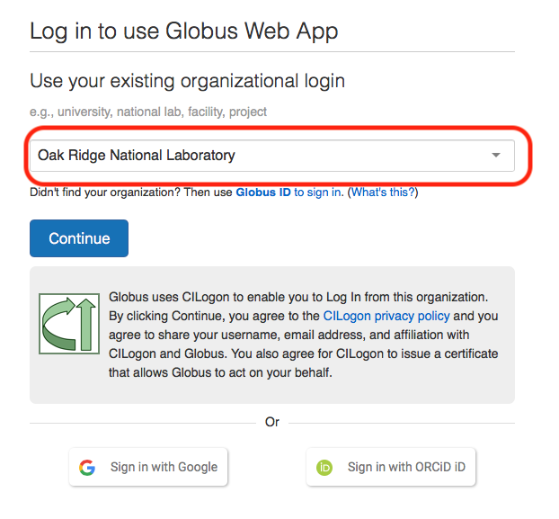
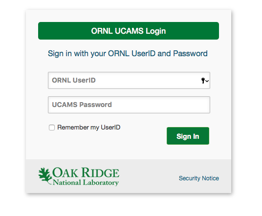
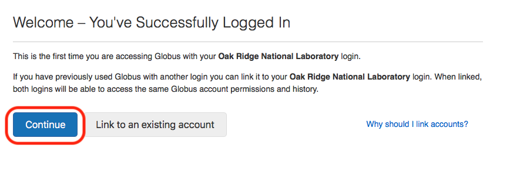
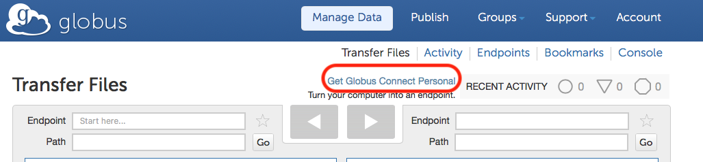
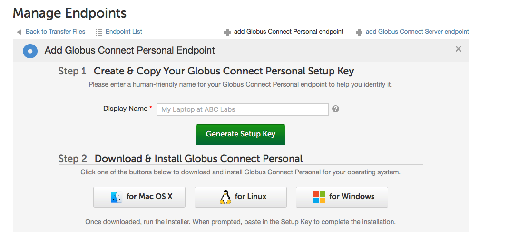

# Globus File Transfer Setup 
Whitney Nelson  
Oak Ridge National Labratory  
Last Edited: June 29, 2018   

### Login/Sign up for Globus

1. Navigate to https://www.globus.org/data-transfer.

2. Click `Login` in the upper left corner.

3. In "Look up organization" section, enter "ORNL" to select Oak Ridge National Laboratory. Then click continue.

4. Enter your UCAMS ID and password in the following page. You should see the following:

5. Click continue and complete the fields for the sign up page.

6. Click `Allow` then you should be directed to the Globus Transfer Files page. 

### Get Globus Connect Personal

**Note: Globus Connect Personal requires a firewall exception for port 2223 and an internet question via ethernet. 
This can be requested at https://ornl.service-now.com. ** 

1. Click Get Globus Connect Personal under the Transfer Files tab.

2. Enter a display name for your device and click Generate Key Setup 

3. Then click download on the icon suitable for your device

6. Once downloaded, run the installer then follow the Globus prompts.
